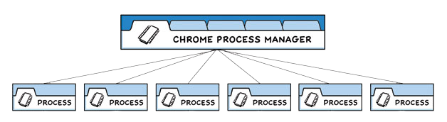

## 架构
Electron 继承了来自 Chromium 的多进程架构，具有两个进程：Main 主进程和 Renderer 渲染进程

### 多进程模型


Electron 的结构与上图非常相似。作为应用开发者，我们可以控制两种类型的进程：主进程 和 渲染器进程。

* Main 主进程：可以调用 Node.js 能力。
* Renderer 渲染进程：不可以调用 Node.js 能力，只能执行网页能力。
* Preload 脚本：在 Renderer 进程之前执行，可以调用 Node.js 能力。虽然 Preload 脚本可以获取到 Renderer 进程中的 Window，但是不能直接把变量传递给 Renderer 进程，只能通过 contextBridge.exposeInMainWorld 的方式，将内容传递给 Renderer。
* HTML 前端界面：这里面可以管理 DOM 结构、样式等。

## 上下文隔离

上下文隔离功能将确保 `预加载脚本(preload)` 和 `Electron 的内部逻辑` 运行在所加载的 `webcontent 网页` 之外的另一个独立的上下文环境里。这对安全性很重要，因为它有助于阻止网站访问 Electron 的内部逻辑 和 高等级权限的API。

> 从 Electron 12 开始，默认启用了 [上下文隔离](<https://releases.electronjs.org/releases/stable?version=12&page=13&limit=2#:~:text=Changed%20the%20default%20value%20of%20contextIsolation%20to%20true>)

### 使用
Electron 提供了 contextBridge 模块来安全地从独立运行、上下文隔离的预加载脚本(preload)中暴露 API 给渲染进程。

```ts
// preload.ts
import { contextBridge, ipcRenderer } from 'electron'
import { ElectronAPI } from './types'

const api: ElectronAPI = {
  setTitle: (title: string) => ipcRenderer.send('set-title', title),
  openFile: () => ipcRenderer.invoke('dialog:openFile')
}

contextBridge.exposeInMainWorld('electronAPI', api)

// 渲染进程 typing.d.ts
import { ElectronAPI } from './types'

declare global {
  interface Window {
    electronAPI: ElectronAPI;
  }
}

// 渲染进程
window.electronAPI.setTitle('title')
```

## 进程通信
> IPC 的全称是 Inter-Process Communication，进程间通信

* 渲染进程到主进程（单向）

  > 渲染进程 ipcRenderer.send 发送，主进程 ipcMain.on 接收

  ```js
  // 主进程
  ipcMain.on('set-title', (event, title) => {
    const webContents = event.sender;
    const win = BrowserWindow.fromWebContents(webContents);
    win.setTitle(title);
  });

  // 渲染进程
  ipcRenderer.send('set-title', '标题内容');
  ```

* 渲染进程到主进程（双向）

  > 渲染进程调用主进程模块并等待结果，通过 ipcRenderer.invoke 与 ipcMain.handle 搭配来使用

  ```js
  // 主进程
  ipcMain.handle('dialog:openFile', async () => {
    const { canceled, filePaths } = await dialog.showOpenDialog();
    if (canceled) {
      return;
    } else {
      return filePaths[0];
    }
  });

  // 渲染进程
  const filePath = await ipcRenderer.invoke('dialog:openFile');
  ```

* 主进程到渲染器进程

  > 从主进程发送到渲染器进程时，需要指定是哪一个渲染器接收消息，通过 win.WebContents.send 发送

  ```js
  // 主进程
  win.webContents.send('close');

  // 渲染进程
  ipcRenderer.on('close', callback);
  ```

* 返回一个回复

  > 1、可以从 ipcRenderer.on 回调中将回复发送回主进程

  ```js
  // 渲染进程
  ipcRenderer.on('close', (event) => {
    event.sender.send('close');
  });

  // 主进程
  ipcMain.on('close', callback);
  ```

  > 2、可以从 ipcMain.on 回调中将回复发送回主进程

  ```js
  // 主进程
  ipcMain.on('getPath', (event, data) => {
    const result = app.getPath(data);
    if (data) {
      event.sender.send('savePath', result);
    }
  });

  // 渲染进程
  ipcRenderer.send('getPath', 'logs');
  ipcRenderer.on('savePath', (event, path) => {
    console.log(path);
  });
  ```

## 问题

-
